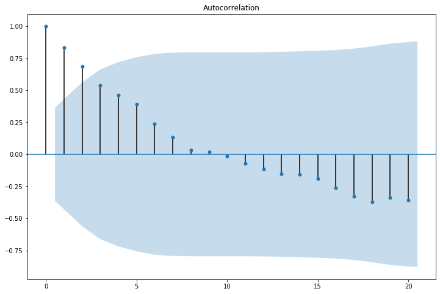
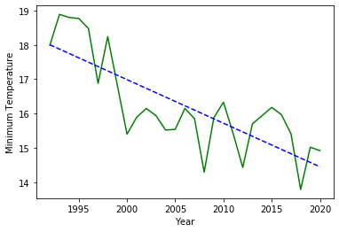
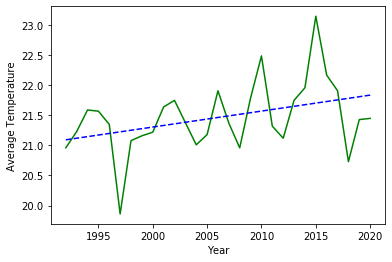
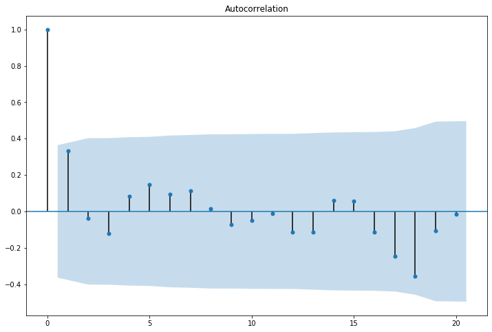

**Performing a Mann-Kendall Trend Test for Temperature Data in Python**

**Why determining the climate trend is important?**

Trend analysis of climate variables such as temperature and precipitation, which offers an overall assessment of the changes in the climate variables, is a fundamental procedure in determining the state of a country's/ district's/ municipality's climate. There is various trend test to determine the climatic variations. Here, in this blog, I will be explaining why I used the Mann-Kendall Trend Test and how this test will determine whether a climatic trend is significant or not using python. The Mann-Kendall Trend Test is used to detect whether time series data has a trend or not. It's a non-parametric test, which means there's no underlying assumption about the data's normality. It can be used in climatic studies to investigate the significance of growing average temperatures over a region over a period of time, as shown below.

**How the Test Works**
This test works by using a hypotheses test. The hypotheses for the test are: 

H0: It is a null hypothesis which means there is no trend present in the data.
H1: It is an alternative hypothesis which means there is a trend present in the data. Here, the trend can be a positive trend as well as a negative trend. 

If the test's p-value is less than a certain threshold (typical thresholds include 0.10, 0.05, and 0.01), there is statistically substantial evidence that a trend exists in the time series data.

**Example: Mann-Kendall Trend Test in Python**

The pymannkendall package must be installed in order to execute a Mann-Kendall Trend Test in Python. After that, all the necessary libraries are imported. 

```
import numpy as np
import pandas as pd
import pymannkendall as mk
import matplotlib.pyplot as plt
import statsmodels.api as sm
%matplotlib inline
```
To calculate the trend analysis, the temperature data of one of the weather stations in Nepal was collected from the Department of Hydrology and Meteorology, Kathmandu. The maximum temperature and minimum temperature data were collected from the year 1992 to 2020.
```
#read dataset
data = pd.read_csv('D:/M/excel/tmax.csv')
data
```
```
plt.plot(data.Year,data.Tmax, 'g')
plt.xlabel('Year')
plt.ylabel('Maximum Temperature')

#calculate equation for trendline
z = np.polyfit(data.Year, data.Tmax, 1)
p = np.poly1d(z)

#add trendline to plot
plt.plot(data.Year, p(data.Year), 'b--')
```


Autocorrelation graphs are a common method for determining the randomness of data collection. The randomness of data values at different time lags is determined by computing autocorrelation. 
```
from datetime import datetime
data['dated'] = pd.to_datetime(data['Year'])
df = data.set_index('dated')
df.drop(['Year'], axis=1, inplace=True)
fig, ax = plt.subplots(figsize=(12, 8))
sm.graphics.tsa.plot_acf(df, lags=20, ax=ax)
plt.show()
```


```
d = mk.original_test(df, alpha=0.05)
d
```


Here is how to interpret the output of the test:
* trend: This tells the trend i.e. whether the data has an increasing, decreasing, or no trend.
* h: True if the trend is present. False if no trend is present.
* p: The p-value of the test.
* z: The normalized test statistic.
* Tau: Kendall Tau.
* s: Mann-Kendal’s score
* var_s: Variance S
* slope: Sen slope
* intercept: Intercept of Kendall-Theil Robust Line


Here, the test trend shows there is an increasing trend in the maximum temperature data with a p-value less than 0.05 which means our null hypothesis is rejected and our alternative hypothesis is accepted. That is, there is a significant positive change in the trend in the last 28 years. The slope is 0.16. 

Using a similar code, the trend for minimum temperature and average temperature from 1992 to 2020 was also calculated. 

Plotting minimum temperature data using plt.plot




The initial lag indicates minor autocorrelation in this ACF plot. So, we can disregard it. Now, calculating the trend using above- mentioned code, we get:


We can conclude that there is a substantial trend in this dataset based on the above result. h=True because the p-value is less than alpha=0.05. The trend is significantly decreasing with a value of -0.125 for the trend/slope. Lastly, the average temperature trend from 1992 to 2020 was calculated using the same code. Plotting the average temperature






Here, the test trend shows there is an increasing trend in the average temperature data with a p-value less than 0.05. That is, there is a significant positive change in the trend in the last 28 years with a slope of 0.019. 

From testing all the three data sets (maximum temperature, minimum temperature, and average temperature), it can be said that the trend analysis reveals a positive trend (maximum temperature and average temperature) and a negative trend in minimum temperature and statistical significance. Because the estimated p-value is less than the alpha (significance threshold), the null hypothesis should be rejected and the alternative hypothesis accepted. 

I'm attempting to demonstrate how a trend can be tested using my blog. More datasets, such as those from the last 50 years, can be used to produce more trustworthy trend test results. I simply ran one trend test here; however, when working with climatic/meteorological data, it is required to run multiple trend tests. Moreover, there are a few things that need to be considered before using the Mann-Kendall Trend Test such as the data collected should not be seasonal i.e. only summer or winter months as the test won't work or give reliable trend; and there should be no missing values, if there are some it can be filled using fillna().

The Mann-Kendall test is a powerful trend test for analyzing seasonal and annual trends in environmental data and climate data, and this test is preferred over others because it can be used with time-series data that does not follow a statistical distribution.

Despite the fact that the code appears simple and the data visualization appears appealing, I found it difficult to get there. This is only possible because of Code for Nepal, and I'd like to express my gratitude to them for giving me the opportunity to study Python through Data Camp.


